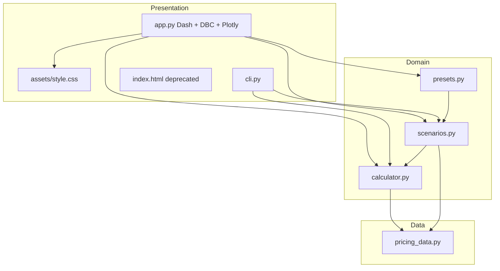
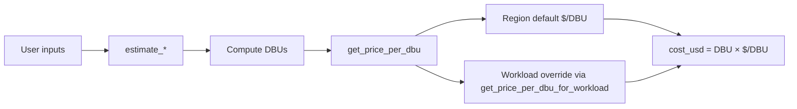

# Design — Databricks GenAI TCO Estimator

| Field | Value |
|-------|--------|
| **Last updated** | 2026-05-30 (v1.1 — AI Functions family, retirement UI) |
| **Companion** | [REQUIREMENTS.md](./REQUIREMENTS.md), [DEV_LOG.md](./DEV_LOG.md) |

---

## 1. System overview

A **single-process Python application**: a **Dash** front end over a **pure-Python estimation core**. No database, no external API calls at runtime. All rates are loaded from `pricing_data.py`.



---

## 2. Module responsibilities

| Module | Lines (approx.) | Responsibility |
|--------|-----------------|----------------|
| `pricing_data.py` | ~880 | Constants: regions, $/DBU, model DBU/M, SKU catalog, helpers (`get_proprietary_model_rates`, `get_all_models_with_pt`, …) |
| `calculator.py` | ~470 | Atomic `estimate_*` functions → `EstimateResult` |
| `scenarios.py` | ~480 | Composite scenarios, `calculate_pt_vs_ppt_breakeven`, `compare_models` |
| `presets.py` | ~170 | S/M/L kwargs for Quick Estimate |
| `ui_helpers.py` | ~150 | Dropdown builders, tier/scale coercion, store helpers, retirement alerts |
| `app.py` | ~1000 | Layout, Dash callbacks, `dcc.Store` aggregation |
| `cli.py` | ~370 | argparse CLI mirroring core capabilities |
| `assets/style.css` | ~300 | Frosted-glass theme, tile grid, tabs |

**Rule:** New product logic belongs in `calculator.py` or `scenarios.py` first; UI only wires inputs/outputs.

---

## 3. Core data types

### 3.1 `EstimateResult` (`calculator.py`)

```python
@dataclass
class EstimateResult:
    description: str      # Human-readable label
    dbu_total: float      # Or DSU-equivalent for storage
    price_per_dbu: float  # Effective $/unit used
    cost_usd: float       # Round to 2 decimals typically
    details: Optional[str]  # Formula breakdown
```

### 3.2 Scenario types (`scenarios.py`)

```python
@dataclass
class ScenarioLineItem:
    service: str
    estimate: EstimateResult

@dataclass
class ScenarioResult:
    name: str
    line_items: list[ScenarioLineItem]
    total_monthly_usd: float
    total_one_time_usd: float  # Reserved; training often amortized in line items
    assumptions: dict
```

### 3.3 Break-even / comparison

- `BreakEvenResult`: PPT vs PT monthly costs, `break_even_qpm`, chart `data_points`.
- `ModelComparisonResult`: parallel lists of models, costs, `EstimateResult` details.

---

## 4. Pricing resolution



| Input type | Typical formula |
|------------|-----------------|
| Vector Search | `dbu_per_hour × units × hours` |
| Model Serving CPU | `1 DBU/hr × request-hours` |
| Model Serving GPU | `dbu_per_hour[size] × hours` |
| Foundation model PPT | `input_M × rate_in + output_M × rate_out` |
| Foundation model PT | `provisioned_hours × dbu_per_hour` (+ optional scaling capacity hours) |
| AI Parse / Extract / Classify | `volume_1k × dbu_per_1k`; shared 50% promo via `_apply_ai_functions_promo` |
| Gateway | `payload_gb × dbu_per_gb` (Inference Tables / Usage Tracking constants) |
| Storage | DSU formula × configurable $/DSU (region-agnostic today) |

**AI Functions promos:** Parse, Extract, and Classify share `AI_FUNCTIONS_PROMO_*` (alias of `AI_PARSE_PROMO_*`). `estimate_ai_parse`, `estimate_ai_extract`, and `estimate_ai_classify` call `_apply_ai_functions_promo` for USD discount only.

**Gemini promo:** `estimate_proprietary_foundation_model(..., apply_gemini_promo=True)` applies 20% off USD for `Gemini*` models through `GEMINI_FM_PROMO_EXPIRY`.

**Proprietary models:** Nested dict in `PROPRIETARY_FOUNDATION_MODEL_DBU_PER_MILLION`; `get_proprietary_model_rates(model, tier)` returns the active rate card.

**Retirement UI:** `MODEL_RETIREMENT_NOTICES` in `pricing_data.py`; `format_model_option_label()` suffixes dropdowns; `retirement_alert()` renders `dbc.Alert` on proprietary, open FM, and break-even tiles.

---

## 5. UI architecture (Dash)

### 5.1 Layout

- **Navbar** + **cloud/region bar** (global `dbc.Select`).
- **Main tabs** (Bootstrap `dbc.Tabs`):
  1. GenAI Calculator — **tile grid** (`_tile()` + `tile-card` CSS)
  2. PT vs PPT Break-Even
  3. Model Comparison
  4. Scenario Templates — conditional forms (`display: none/block`)
  5. Quick Estimate — radio presets
- **Sidebar** — pricing source links (`sidebar-glass`).

### 5.2 Callback pattern (GenAI Calculator)

Each service tile uses a **dual-output callback**:

- `Output("*-result", "children")` — `cost_badge()` or `dbc.Alert` on error
- `Output("store-*", "data")` — numeric cost for aggregation

A **summary callback** sums `store-*` values into ballpark monthly + training one-time.

`suppress_callback_exceptions=True` allows tabs to mount without all IDs present on first paint.

### 5.3 Scenario rendering

`_render_scenario_result(result)`:

1. Total monthly headline
2. Pie chart **only if** any line item `cost_usd > 0`
3. `<details>` line-item list with % of total

### 5.4 Styling

- `assets/style.css` auto-served by Dash from `/assets`.
- CSS variables: `--db-red`, glass backgrounds, `.tile-grid`, `.summary-card`.

---

## 6. Scenario heuristics (documented assumptions)

These are **engineering estimates**, not from a single pricing page row.

| Scenario | Heuristic |
|----------|-----------|
| **RAG — embeddings** | `chunks × 256 tokens / 1e6` × embedding model input rate |
| **RAG — VS units** | `ceil(total_vectors / capacity_per_unit)` Standard tier, 720 h/mo |
| **RAG — gateway** | `queries × (in+out tokens) × 4 bytes` → GB → gateway DBU |
| **RAG — storage** | `docs × pages × 50 KB` → GB → DSU |
| **Multi-agent** | Orchestrator calls = `requests × (1 + steps)`; worker = `requests × steps × tools` |
| **Batch** | Jobs ≈ `0.5 DBU-h per 1k docs processed` |
| **Fine-tune** | Training cost `/ retraining_cadence_months`; PT = `serving_hours_per_day × 30` |

When a base model has **no** `provisioned_per_hour`, fine-tune scenario adds a **$0 line item** with explanation (not silent omission).

---

## 7. CLI design

- Global flags: `--cloud`, `--region` (default per cloud).
- Subcommands map 1:1 to `estimate_*` or scenario functions.
- Human-readable `_print_result()` for terminal use.

**Gap:** CLI still exposes SQL/storage/compute commands from earlier “full calculator” scope; Dash UI is **GenAI-focused only**. CLI remains the broader surface.

---

## 8. Deployment

| Target | Mechanism |
|--------|-----------|
| Local | `python app.py` → `app.run(host="0.0.0.0", port=int(os.environ.get("PORT", 8000)))` |
| Shell | `./run_app.sh` |
| Databricks Apps | `app.yaml`: `command: [python, app.py]` |

**Dependencies:** `dash`, `dash-bootstrap-components`, `plotly`, `pandas`, `numpy` (pandas/numpy for potential data/export use — verify actual imports before removing).

---

## 9. Extension guide

### 9.1 Add an AI Functions workload (Extract / Classify style)

1. Add midpoint DBU/1k to `AI_EXTRACT_DBU_PER_1K_INPUTS` or `AI_CLASSIFY_DBU_PER_1K_DOCUMENTS` and label tuple in `pricing_data.py`.
2. Implement or reuse `estimate_ai_extract` / `estimate_ai_classify` in `calculator.py`.
3. Add tile + callback + `GENAI_STORE_KEYS` entry in `ui_helpers.py` and `app.py`.
4. Extend CLI `ai-extract` / `ai-classify` and `list` subcommands.
5. Log in `PRICING_SOURCES.md` and `docs/PRICING_FITMENT.md`.

### 9.2 Add a new GenAI list price (e.g. new FM model)

1. Add rates to `pricing_data.py` (`FOUNDATION_MODEL_DBU_PER_MILLION` or proprietary dict).
2. Log source in `PRICING_SOURCES.md`.
3. If UI needs new fields, extend tile in `app.py` + callback.
4. Add CLI `list` / command if applicable.
5. Update `docs/DEV_LOG.md`.

### 9.3 Add a new scenario template

1. Implement `estimate_*_scenario()` in `scenarios.py`.
2. Add form block + callback branch in `app.py`.
3. Optional: presets in `presets.py`.
4. Add CLI `scenario` subcommand branch.
5. Update requirements + dev log.

### 9.4 Refresh pricing data

1. Follow [PRICING_FITMENT.md](./PRICING_FITMENT.md) checklist.
2. Run `python scripts/pricing_fitment_check.py` and `pytest tests/ -q`.
3. Update `PRICING_SOURCES.md` audit table.

---

## 10. Known limitations

| Area | Limitation |
|------|------------|
| Accuracy | Illustrative $/DBU; committed-use discounts not modeled |
| Storage in scenarios | Fixed $/DSU; not region-aware |
| Batch scenario Extract/Classify | Assumes 1 extract input / 1 classify doc per parsed document; workload-specific page counts not double-counted |
| `index.html` | Deprecated; not synced with model catalog |
| Model count in README | May drift; source of truth is `pricing_data.py` |

---

## 11. Revision history

| Date | Change |
|------|--------|
| 2026-05-30 | Initial design doc (Dash architecture, post–Streamlit migration) |
| 2026-05-30 | AI Extract/Classify, shared AI Functions promo, retirement notices, Gemini promo |
| 2026-05-30 | Batch scenario Extract/Classify; pip-compile lockfiles |
